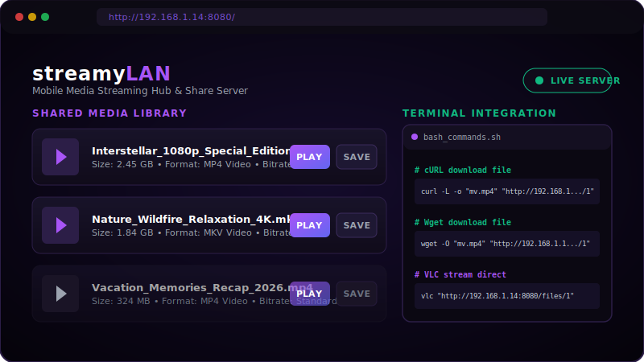
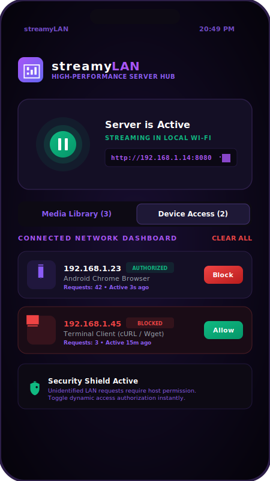
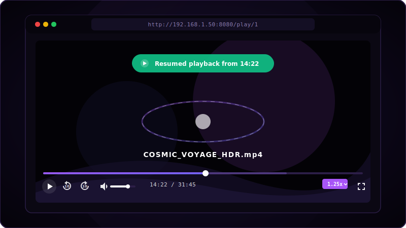

# ⚡ streamyLAN - Mobile Media Hub & LAN Streamer

An ultra-lightweight, high-performance local network streaming and file-sharing ecosystem.

---

## 📺 Interface Previews

| **Web Client Dashboard** | **Android App Interface** | **Premium Video Player** |
|:---:|:---:|:---:|
|  |  |  |
| *Modern dark-themed responsive browser interface showing shared files grid and copyable terminal CLI instructions.* | *Clean, single-view Jetpack Compose mobile panel featuring central pulsing server controls and the connection firewall.* | *Advanced video playback controls with dynamic 0.5x–2.0x speed adjustment and local storage resume notifications.* |

---

**streamyLAN** is a powerful offline-first **local Wi-Fi file sharing app** and **Android HTTP media server** that instantly transforms your mobile device into a high-bandwidth LAN streaming node. Designed for developers, power users, and movie enthusiasts, it provides seamless **LAN video streaming without internet**, allowing any laptop, Smart TV, or tablet on your network to stream or download media files directly via their web browsers. 

With full support for **HTTP Range Requests (byte-range scrubbing)**, users can seek through multi-gigabyte 4K/HDR MP4/WebM videos with zero buffering. It integrates a secure **IP access control system (firewall)** to let hosts block or grant client access in real-time. Whether you are searching for a high-performance **offline file sender**, a **Wi-Fi server for terminal/CLI downloads**, or a **VLC-ready media streamer**, streamyLAN delivers absolute performance with modern Material Design 3 elegance.

---

## 🚀 Features

- **High-Performance Local Web Server**: Stream media to any device (Mac, PC, Linux, iOS, Android, Smart TVs) using clean, browser-native inline HTML5 players.
- **Advanced Video Controls**:
  - **Dynamic Playback Speed Controls**: Seamlessly adjust speed from **0.5x** to **2.0x** on the fly via the custom web controller dropdown.
  - **Smart Resume Playback (Local Storage)**: Saves the exact video timestamp automatically, letting you resume watching right where you left off, even across page reloads.
  - **Double-Tap & Hotkeys**: Full keyboard shortcut support (Space for Play/Pause, Left/Right Arrows for 10s skips, F for Fullscreen, M for Mute) and double-click to fullscreen.
- **Auto LAN Discovery (UDP Subnet Scan)**: Pings and auto-detects other active `streamyLAN` nodes running on your local Wi-Fi. Just tap **Connect** to access peer libraries.
- **Live Device Access Panel (Firewall)**: Real-time network monitor showing all active client IPs and user-agent strings. Block intrusive clients or clear cache instantly.
- **CLI Terminal Friendly**: Displays pre-generated, copyable `cURL`, `wget`, and `VLC` terminal commands for downloading or streaming over the local network.
- **Adaptive Range Support**: Implements standard HTTP/1.1 `Range: bytes` chunked serving for instant, buffer-free timeline scrubbing in browsers and external players like VLC.
- **Custom TCP Port Config**: Bind the web server to any custom port (from 1024 up to 65535) to avoid local port conflicts.
- **Foreground Service Protection**: Keeps the network server alive in background mode with a persistent system notification card to prevent Android OS reclamation.

---

## 📖 Usage & Help

### 1. Host Mode (Sharing files from Android)
- Launch **streamyLAN** on your Android device.
- Tap **Add Media** to choose any video, audio, or document file from your storage.
- Select your preferred TCP port (default is `8080`).
- Tap the **Central Start Pulse Button** to launch the local web server.
- The app will display your local LAN URL (e.g., `http://192.168.1.100:8080`).

### 2. Client Mode (Streaming/Downloading)
- Open any web browser on another computer, TV, or smartphone connected to the same Wi-Fi.
- Enter the displayed host URL.
- Browse the shared media list, download files directly, or play videos in the custom premium web player.
- Watch as the Android app updates progress, showing transfer speeds and connection states in real-time!

### 3. Subnet Peer Discovery
- Navigate to the **Discover LAN** tab in the Android app.
- Tap **Scan LAN** to broadcast a UDP discovery packet over your subnet.
- Any other Android device on the network running streamyLAN will respond and appear in your peer grid with a direct **Connect** button!

---

## 🛠️ Instructions for Devs

### Development Requirements
- **Android Studio** (Koala or newer recommended)
- **Android SDK 34** (targetSdk)
- **Kotlin 1.9.x** & **Gradle 8.x**
- **JDK 17** configured in your development environment.

### Project Structure & Key Classes
- `/app/src/main/java/com/example/SimpleHttpServer.kt`: The core, multi-threaded HTTP/1.1 socket server serving custom HTML content, range headers, and binary file streams.
- `/app/src/main/java/com/example/DiscoveryManager.kt`: Manages UDP broadcasts on port `8888` for auto-detecting streamyLAN instances across the subnet.
- `/app/src/main/java/com/example/ServerManager.kt`: Shared state holder storing shared files list, active streaming progress tracker, and client IPs.
- `/app/src/main/java/com/example/MainActivity.kt`: The modern Material 3 Jetpack Compose application UI.

### Compilation & Build Commands

Always execute Gradle commands using the standard wrapper (or system Gradle):

#### 1. Compile the project and verify build
```bash
gradle assembleDebug
```

#### 2. Run Kotlin Linter
```bash
gradle lint
```

#### 3. Build & Package Release APK
```bash
gradle assembleRelease
```
*The compiled APKs will be located under `app/build/outputs/apk/debug/` and `app/build/outputs/apk/release/`.*

#### 4. Run Unit & Robolectric Tests
```bash
gradle :app:testDebugUnitTest
```

---

## 😉 You Know

Did you know that streaming video files over a standard local Wi-Fi router (using direct socket connections) has a transfer speed of up to **450 Mbps** with practically **0ms latency**? Unlike cloud solutions (Google Drive, Dropbox) or internet-dependent sharing apps which upload data to remote servers and download it back, **streamyLAN** works 100% locally. Your video bytes bypass the internet entirely, flowing straight from your phone's memory controller directly to the client's router antennas. This means you can stream pristine, uncompressed 4K Blu-ray files smoothly without ever burning a single kilobyte of cellular data!

---

## Contribution ?

We Need Help !
